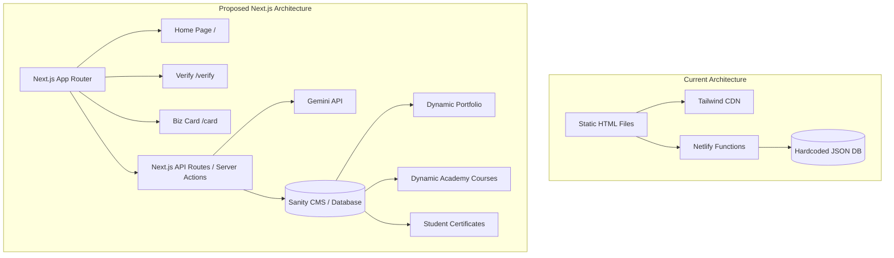
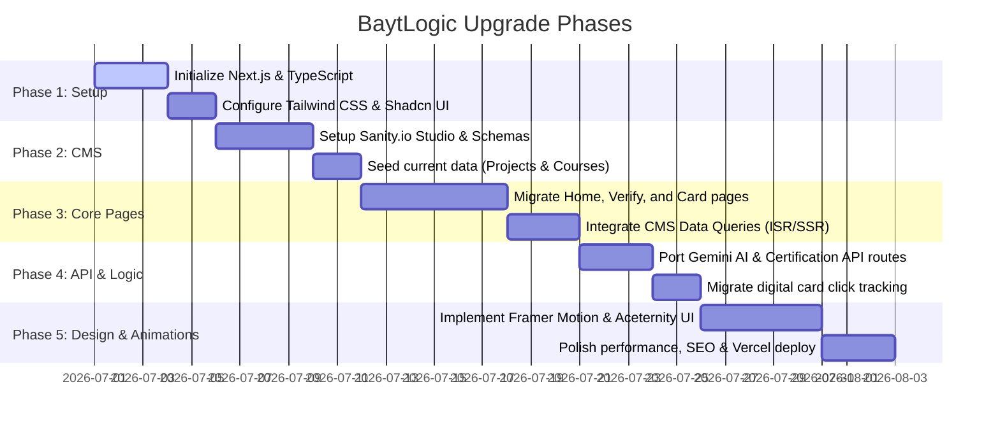

# BaytLogic Technologies – Website Upgrade Roadmap

This document outlines the strategic roadmap for migrating the current static website of BaytLogic Technologies to a modern, high-performance, dynamic architecture. It details the analysis of the current structure, the migration path to Next.js, headless CMS integration, and premium UI styling recommendations.

---

## 1. Analysis of Current Structure

The current codebase ([baytlogic-site](file:///C:/Users/PC/OneDrive/Desktop/baytlogic-site)) is structured as a lightweight, static multipage site with Netlify serverless functions for backend processing.

### Key Files & Components
*   **[index.html](file:///C:/Users/PC/OneDrive/Desktop/baytlogic-site/index.html)**: The main landing page, showcasing smart home automation, security solutions, EdTech services, and upcoming training courses. It features custom scroll animations (AOS), dynamic icons (Lucide), a neural network canvas particle system, and an AI Architect interface.
*   **[verify.html](file:///C:/Users/PC/OneDrive/Desktop/baytlogic-site/verify.html)**: The client-side certificate verification page where students query unique IDs to verify their certificates.
*   **[card.html](file:///C:/Users/PC/OneDrive/Desktop/baytlogic-site/card.html)**: A digital business card for the lead engineer, featuring quick action buttons and a timed WhatsApp redirect with click tracking.
*   **[netlify.toml](file:///C:/Users/PC/OneDrive/Desktop/baytlogic-site/netlify.toml)**: Project configuration routing public files to the root directory and defining the serverless function path.
*   **[netlify/functions/](file:///C:/Users/PC/OneDrive/Desktop/baytlogic-site/netlify/functions)**:
    *   [security-blueprint.js](file:///C:/Users/PC/OneDrive/Desktop/baytlogic-site/netlify/functions/security-blueprint.js): Communicates securely with the Gemini API (`gemini-2.5-flash`) using an environment variable key to generate markdown-formatted AI security blueprints.
    *   [verify-cert.js](file:///C:/Users/PC/OneDrive/Desktop/baytlogic-site/netlify/functions/verify-cert.js): Contains a hardcoded dictionary (`certificateDatabase`) mapping certificate IDs to student records. It normalizes inputs (e.g. padding numbers, stripping spaces) and validates matching IDs.
    *   [track.js](file:///C:/Users/PC/OneDrive/Desktop/baytlogic-site/netlify/functions/track.js): A basic hook logging user interaction types (clicks, calls) on the digital business card.

### Current Limitations
1.  **Tailwind CDN Usage**: Injecting Tailwind via a `<script>` tag is inefficient for production, leading to unoptimized page loads and layout shifts.
2.  **Hardcoded Certificate Database**: Because certificates are hardcoded directly into [verify-cert.js](file:///C:/Users/PC/OneDrive/Desktop/baytlogic-site/netlify/functions/verify-cert.js), any new student certification requires a manual code modification and redeployment.
3.  **Static Portfolio & Training Data**: Project case studies and training bootcamps are coded directly in HTML. This lacks flexibility for rapid updating.
4.  **No Server-Side Rendering (SSR)**: The site cannot leverage dynamic rendering, search engine optimization (SEO) previews for specific projects, or fast server-side checks.

---

## 2. Next.js Migration Strategy

Migrating to **Next.js (App Router)** with **TypeScript** and a compiled build step will address performance constraints while laying the groundwork for a scalable portal.

### Proposed Page Routing Map
*   `src/app/page.tsx` (Homepage): Houses the migrated sections from [index.html](file:///C:/Users/PC/OneDrive/Desktop/baytlogic-site/index.html). Replaces static elements with custom React components.
*   `src/app/verify/page.tsx` (Certificate Verification): Migrates the logic of [verify.html](file:///C:/Users/PC/OneDrive/Desktop/baytlogic-site/verify.html) with clean React hooks and inputs.
*   `src/app/card/page.tsx` (Digital Business Card): Replaces [card.html](file:///C:/Users/PC/OneDrive/Desktop/baytlogic-site/card.html), serving as a clean, responsive redirect card page with custom countdown effects.
*   `src/app/api/security-blueprint/route.ts`: Replaces [security-blueprint.js](file:///C:/Users/PC/OneDrive/Desktop/baytlogic-site/netlify/functions/security-blueprint.js).
*   `src/app/api/verify-cert/route.ts`: Replaces [verify-cert.js](file:///C:/Users/PC/OneDrive/Desktop/baytlogic-site/netlify/functions/verify-cert.js), querying the CMS or a secure database instead of a static dictionary.
*   `src/app/api/track/route.ts`: Replaces [track.js](file:///C:/Users/PC/OneDrive/Desktop/baytlogic-site/netlify/functions/track.js) to store tracking metrics.

### Key Implementation Guidelines
1.  **State Management & Effects**: Migrate the IntersectionObserver scroll counters and neural network particle canvas code into React `useEffect` hooks and native `<canvas>` refs, ensuring cleanup functions run properly.
2.  **Form Submissions**: Replace the Netlify HTML form tag with a secure React-friendly form submission handler. You can either utilize Netlify's Next.js runtime integration or handle forms through a serverless email integration (e.g. Resend or SendGrid) within a Next.js Server Action.
3.  **Environment Variables**: Securely store `GEMINI_API_KEY` and CMS tokens inside `.env.local` for development and configure them in the deployment provider (Vercel/Netlify) dashboard.

---

## 3. Headless CMS Integration

Integrating a Headless CMS enables non-technical team members to manage training courses, upload portfolio projects, and issue certificates without writing a single line of code.

### Recommended CMS: Sanity.io
Sanity is highly recommended for this project due to its developer-first approach, real-time visual editing workspace, generous free tier, and seamless Next.js SDK (`next-sanity`).

### Core Content Schemas

#### 1. Projects (Portfolio)
Defines the installation case studies shown on the homepage or a dedicated portfolio page.
*   `title` (String): E.g., "University Laboratory CCTV"
*   `slug` (Slug): Auto-generated URL string (e.g., `university-laboratory-cctv`).
*   `location` (String): E.g., "ATBU – CCE Laboratory"
*   `category` (String): Dropdown (Surveillance, Automation, AI Systems, EdTech)
*   `description` (Text): Details of the installation, components, and challenges.
*   `image` (Image): Main portfolio photo.
*   `completionDate` (Date): Completion timeline.

#### 2. Academy Courses (Bootcamps)
Allows scheduling and changing course details on the academy page.
*   `title` (String): E.g., "Smart Home Automation & CCTV"
*   `slug` (Slug): E.g., `smart-home-automation-cctv`
*   `startDate` (Date): Course start date.
*   `endDate` (Date): Course end date.
*   `description` (Text): Brief breakdown of the curriculum.
*   `registrationLink` (Url): Google Forms, WhatsApp link, or custom checkout.
*   `price` (String): Pricing structure (optional).
*   `status` (String): Dropdown (Pre-register, Active, Completed).

#### 3. Certificates
Replaces the hardcoded JS object, allowing instant verification of new graduates.
*   `certificateId` (String): Unique identifier (e.g. `BLT-2026-027`).
*   `studentName` (String): Name printed on the certificate.
*   `course` (Reference): Reference link pointing to the **Academy Courses** schema.
*   `issueDate` (Date): Date of issuance.
*   `status` (String): Current validation status (Valid, Suspended, Revoked).

---

## 4. Premium Design Libraries for a "Silicon Valley Tech" Aesthetic

To give the upgraded site the premium, high-fidelity look of top Silicon Valley engineering firms (such as Vercel, Linear, or Supabase), the following libraries are recommended:

### 1. Framer Motion
*   **What it does**: The industry standard for complex React animations, orchestrating entrance layouts, page transitions, and interactive physics.
*   **Silicon Valley Vibe**: Replaces rigid CSS transitions with natural, physics-based springs. It will power fluid hover states on project cards, smooth accordion menus, and dynamic micro-interactions.
*   **Key Use Case**: Smoothly animating the generation of the AI Security Blueprint, making sections slide and fade into view naturally as they are parsed.

### 2. Aceternity UI (`ui.aceternity.com`)
*   **What it does**: A collection of beautiful, copy-paste Tailwind + Framer Motion components designed specifically for the developer-centric dark-mode aesthetic.
*   **Silicon Valley Vibe**: Delivers grid patterns, glowing border cards, glowing background beams, and tracing lines.
*   **Key Use Case**:
    *   *Grid Backgrounds & Glow Beams* in the Hero section to replace the basic canvas particles with interactive, glowing grid lines.
    *   *Card Hover Effects* and *Hover Borders* on services and portfolio grids to create a sleek, interactive premium feel.

### 3. Shadcn UI / Radix UI
*   **What it does**: A highly customizable library of unstyled, accessible UI components. It doesn't ship as an NPM package; instead, code is generated directly into your codebase for full control.
*   **Silicon Valley Vibe**: Clean typography, pixel-perfect borders, minimalist forms, and dark-mode optimization matching modern design systems.
*   **Key Use Case**:
    *   *Dialogs/Modals*: Sleek overlays for certificate information display and quotation forms.
    *   *Toast Notifications*: Interactive alerts when users copy a certificate link, successfully submit a form, or encounter an error.
    *   *Custom Select Inputs*: Polished dropdown menus for quotation requests.

---

## 5. Upgrade Phases & Timeline

### Next Steps for Implementation
1.  Initialize the project: `npx create-next-app@latest baytlogic-site-upgrade --typescript --tailwind --eslint`.
2.  Deploy the repository on Vercel or Netlify to bind development/production environments.
3.  Set up the Sanity Studio workspace to host content for portfolio and graduates.
4.  Apply the modern Silicon Valley UI patterns using Shadcn UI and Framer Motion.
